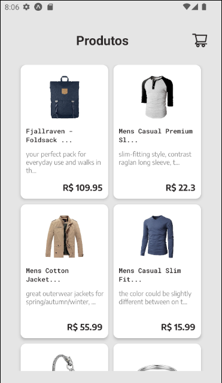

# Store (fakestoreapi)
<h1 align="center">
   
</h1>

### Sobre o projeto

O projeto tem como objetivo construir uma aplicação utilizando typescript, utilizando algumas tecnologias que estão presente no mercado, como, styled component, react-navigation, axios, async storage, fonts do google e icones do ant design.

---

### Tecnologias
<p>


</p>

### Iniciando o projeto

```bash
# Clonar aplicação

$ git clone https://github.com/Jhonatan-Holanda/Store-App

# Acessar a aplicação
$ cd Store

# Execute npm i para instalar as dependências
$ npm i

# Inicie a aplicação
$ npx expo start

```

### Testes

```bash
# Executando teste
$ npm test

# Gerando relatório dos testes
$ npm run test:coverage
```
